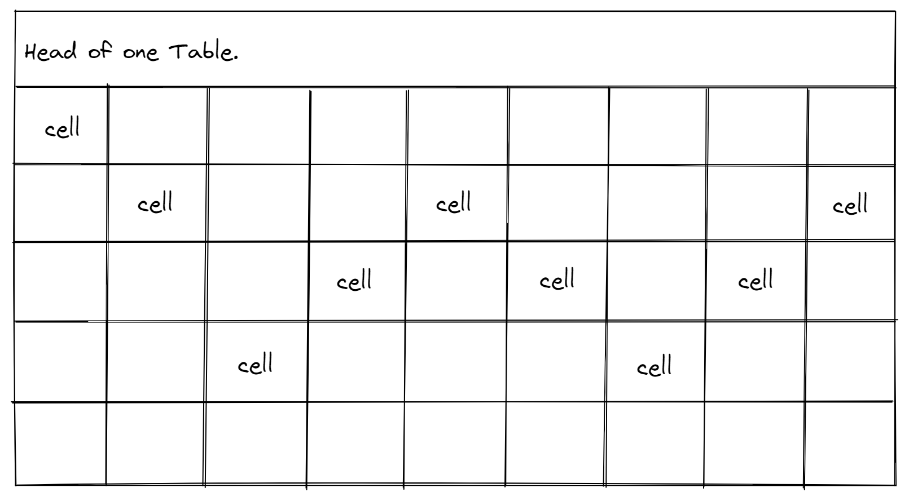

Covalent Bound Table Class
---
```
Author: chenghua Wang.
```

# Abstract

为了存储从后端数据库请求来的数据并且利于计算图计算，我设计了一个 Table 类来存储真实的数据(拥有真实的内存)，一个 Reference Virtual Table 用来做中间数据和最终数据的存储 (使用 Table 类内部的数据)。这个 Table 类和矩阵计算库中的 Matrix 类型相似。本实现也受 Eigen/Torch 等计算库的启发，实现了 Lazy Compute 和 计算图 模式。

为了方便实现且具有较大的普适性，这个 Table 实现只考虑关系型数据，不支持图类型的数据库关联。

# Head

# Cells


# Table/Row/Col

# A reference class for Table/Row/Col

# Memory managing conventional
